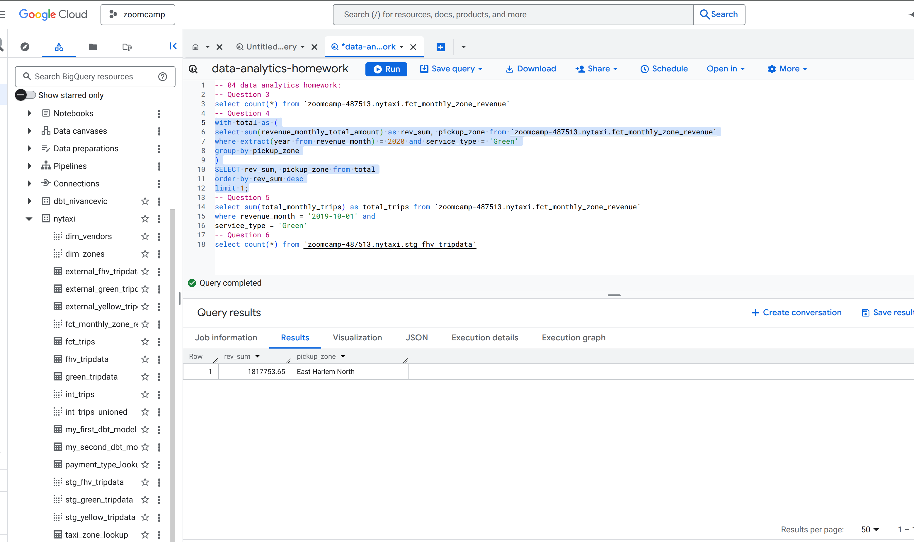
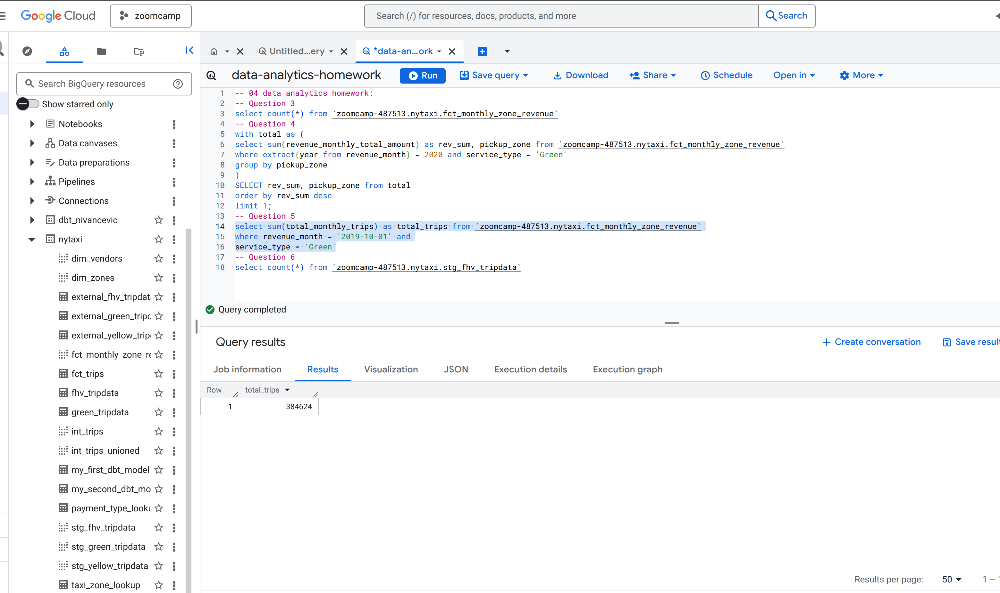
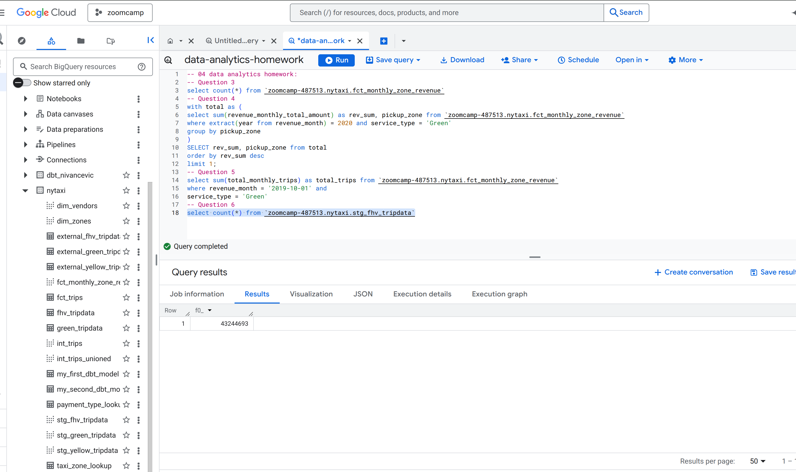

-- Question 1
Only one model will be built
From the docs and videos
-- Question 2
dbt fails the test with non-zero exit code
since it doesn't match the requirement
from the docs and videos.
-- Question 3
select count(*) from `zoomcamp-487513.nytaxi.fct_monthly_zone_revenue`
result = 12184

-- Question 4
with total as (
select sum(revenue_monthly_total_amount) as rev_sum, pickup_zone from `zoomcamp-487513.nytaxi.fct_monthly_zone_revenue`
where extract(year from revenue_month) = 2020 and service_type = 'Green'
group by pickup_zone
)
SELECT rev_sum, pickup_zone from total
order by rev_sum desc
limit 1;

result = East Harlem North with 1817753.65 revenue

-- Question 5
select sum(total_monthly_trips) as total_trips from `zoomcamp-487513.nytaxi.fct_monthly_zone_revenue`
where revenue_month = '2019-10-01' and
service_type = 'Green'
total_trips = 384624

-- Question 6
select count(*) from `zoomcamp-487513.nytaxi.stg_fhv_tripdata`
result = 43244693
